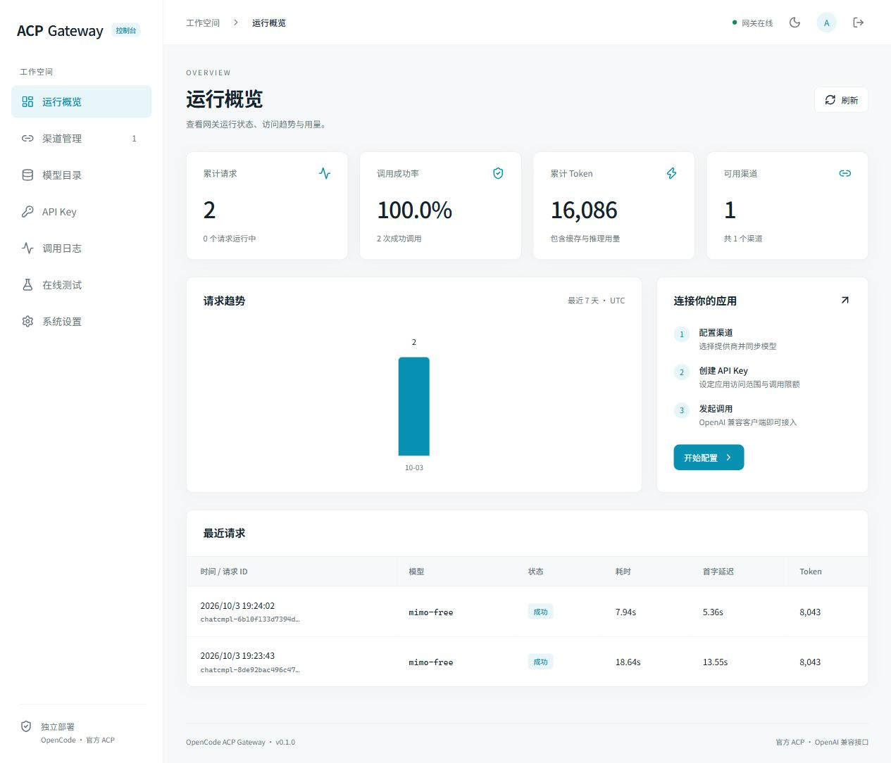

# OpenCode ACP Gateway

独立部署的 OpenCode ACP → OpenAI 兼容网关，配有参考 New API 信息架构的管理控制台。



## 功能

- 完整中文控制台：概览、渠道、模型、API Key、调用日志、在线测试、设置，支持浅色/深色和手机布局。
- 渠道支持启停、优先级、加密凭据与 HTTP 代理、并发、超时、免费模型筛选和模型别名，从官方 CLI 同步目录。
- API Key 一次性显示完整值，支持撤销、到期、模型白名单、每分钟/每日请求限额、并发和累计 Token 准入阈值。
- 普通/SSE 对话、推理内容、真实缓存/推理用量；JSON 输出校验和客户端函数调用意图转换。
- 日志只保存元数据：模型、状态、总耗时、首字延迟、用量和错误码，不保存对话正文或完整密钥。
- 在线测试可停止生成，Key 仅在页面内存中使用；管理员改密、操作审计、部署状态与接入示例。

## Linux Docker 部署

```bash
git clone https://github.com/xtawa/opencode-acp-gateway.git
cd opencode-acp-gateway
cp .env.example .env
docker compose up -d --build
docker compose exec gateway cat /data/bootstrap-token
```

默认仅监听本机 `127.0.0.1:8080`。打开 `http://127.0.0.1:8080`，首次填写上一步引导令牌并创建管理员，密码至少 12 位。远程服务器可使用 SSH 端口转发访问。令牌只用于首次初始化，不要提交到仓库。

添加渠道 → 同步模型 → 创建 API Key。默认提供商 `opencode`，只筛选目录标价为零的模型。模型 ID 和可用性以当前同步结果为准。使用 OpenCode 免费模型前，需要在渠道中明确确认其数据使用政策；其他提供商可以填写自己的凭据并关闭免费筛选。

### HTTPS

为实际域名配置 DNS，允许 80/443 入站，然后编辑 `.env`：

```dotenv
GATEWAY_DOMAIN=gateway.example.com
GATEWAY_PUBLIC_ORIGIN=https://gateway.example.com
GATEWAY_SECURE_COOKIES=true
```

```bash
docker compose --profile https up -d --build
```

随附 Caddy 自动申请和续期证书，保持 SSE 实时传输。必须替换示例域名。自己的反向代理应转发到本机 8080，关闭流式缓冲，设置适合渠道超时的读超时，并同步配置 Origin 和 Secure Cookie。仅在需要信任转发头时将 `GATEWAY_TRUSTED_PROXIES` 设置为实际代理地址/网段。

### 数据与升级

`gateway-data` 卷保存 SQLite、加密密钥、引导令牌和隔离的 CLI 运行目录。停服务后完整备份该卷，数据库和 `encryption.key` 必须一起保留。删除卷会失去配置、密钥与审计记录。

```bash
git pull --ff-only
docker compose up -d --build
```

镜像固定 OpenCode `1.18.34`，可通过 `.env` 的 `OPENCODE_VERSION` 显式升级后重建。当前设计为单实例、单 Python worker，不要让多个网关实例共用同一数据目录。

## API 接入

客户端 Base URL 为 `http://127.0.0.1:8080/v1`，Key 使用控制台生成的应用密钥。

```bash
curl http://127.0.0.1:8080/v1/models \
  -H "Authorization: Bearer $GATEWAY_API_KEY"

curl http://127.0.0.1:8080/v1/chat/completions \
  -H "Authorization: Bearer $GATEWAY_API_KEY" \
  -H 'Content-Type: application/json' \
  -d '{"model":"YOUR_SYNCED_MODEL_ID","messages":[{"role":"user","content":"你好"}],"stream":true,"stream_options":{"include_usage":true}}'
```

模型名必须换成 `/v1/models` 中的 ID，也可以设置渠道别名。接口细节见 [API 文档](docs/api.md)。

## 兼容范围

- 文本 `system/developer/user/assistant/tool` 消息保留角色，通过提示桥接 ACP，不等同于原生 Chat Completions 参数透传。
- 每次请求创建新的 ACP 会话，客户端需提交所需完整历史；结束、失败或取消时取消/关闭并通过官方 HTTP 接口删除会话。清理失败显式报错，渠道在下次使用前重启。
- 不提供 ACP 文件系统、终端或 MCP 能力，原生工具权限请求全部拒绝。API 函数工具是经过名称与 Schema 校验的调用意图，由客户端执行。
- 普通文本实时流式输出，工具与 JSON 模式先缓冲、校验再输出；不能保证所有模型都遵守结构化输出要求，失败会报错。流内上游错误通过 SSE error 返回，不伪造成功结束。
- `reasoning_effort` 使用官方配置选项，支持情况由模型决定。用量缺失时不估算 Token。
- 暂不支持图片/音频、Responses API、embeddings、文件上传，以及 `temperature/max_tokens` 等无法准确映射的参数；未知参数返回 400。
- Token 限额是按已完成请求实际用量的准入阈值，达到后阻止新请求，允许在途请求完成，可能超出阈值。每日限额与趋势按 UTC 计算。
- 按优先级选取已同步且启用的渠道；失败不自动重试或换模型，不规避提供商额度或使用政策。

## 本地开发

需要 Python 3.12+、Node.js 22+ 和官方 OpenCode CLI。

```bash
python -m venv .venv
. .venv/bin/activate
pip install -e '.[dev]'
cd web
npm ci
npm run build
cd ..
python -m gateway
```

`GATEWAY_OPENCODE_BINARY` 可指定官方 CLI 路径，`GATEWAY_PORT` 可修改端口。前端开发运行 `cd web && npm run dev`，API 默认转发到本机 8080。

```bash
ruff check .
ruff format --check .
pytest -q
cd web
npm test
npm run build
```

## 验证

实际官方 CLI 普通/流式模型调用、会话清理、权限拒绝、错误恢复、并发限额及界面验证见 [验证记录](docs/validation.md)。GitHub Actions 检查 Python、前端、Docker 构建和容器健康。原创代码采用 MIT 许可。

无需安装 MaiBot 或 AstrBot。核心桥接机制从已有 MaiBot OpenCode ACP 插件抽离；网关不会继承原插件的运行数据、账号或密钥。

## 设计来源

- [OpenCode ACP](https://opencode.ai/docs/acp/)
- [OpenCode Server](https://opencode.ai/docs/server/)
- [OpenCode Config](https://opencode.ai/docs/config/)
- [Agent Client Protocol](https://agentclientprotocol.com/protocol/prompt-turn)
- [New API](https://github.com/QuantumNous/new-api)：仅作为界面信息架构参考，不复制其实现。
